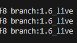

# 热更新下载MD5 | regio info
# 保存为regio info的JSON文件格式
# txt是直更的（官dispatch）放RES文件夹下就可以了如果不读`branch`自行数据库添加
## 如果更新错误的时候需要注意`branch`是否读取了
## 可以通过解`region`来查看或者在`dispatch.log`可以查看

# txt文件未经过完全测试
|VER |IOS|PC|PS4|PS5|ANDROID|
|--:|---|---|---|---|---|
|**1.0**|➖|✔|➖|➖|➖|
|**1.2**|➖|➖|➖|➖|➖|
|**1.3**|➖|➖|➖|➖|➖|
|**1.4**|➖|➖|➖|➖|➖|
|**1.5**|➖|➖|➖|➖|➖|
|**1.6**|➖|✔|➖|➖|✔|
|**2.0**|➖|✔|➖|➖|✔|
|**2.2**|➖|➖|➖|➖|➖|
|**2.3**|➖|➖|➖|➖|➖|
|**2.4**|➖|✔|➖|➖|➖|
|**2.6**|➖|➖|➖|➖|➖|
|**2.7**|➖|➖|➖|➖|➖|
|**2.8**|➖|✔|➖|➖|➖|
|**3.0**|➖|➖|➖|➖|➖|
|**3.1**|➖|➖|➖|➖|➖|
|**3.2**|✔|✔|➖|➖|✔|
|**3.3**|➖|➖|➖|➖|➖|
|**3.4**|✔|✔|➖|➖|✔|
|**3.5**|➖|➖|➖|➖|➖|
|**3.6**|✔|✔|➖|➖|✔|
|**3.7**|✔|✔|➖|➖|✔|
|**4.0**|➖|➖|➖|➖|➖|
